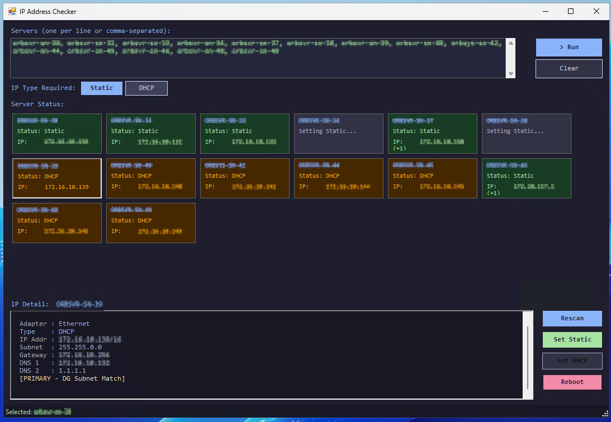
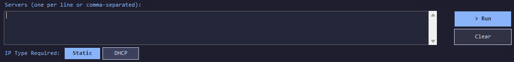
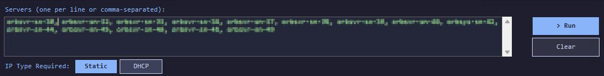
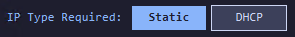
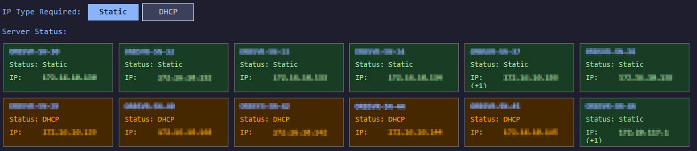
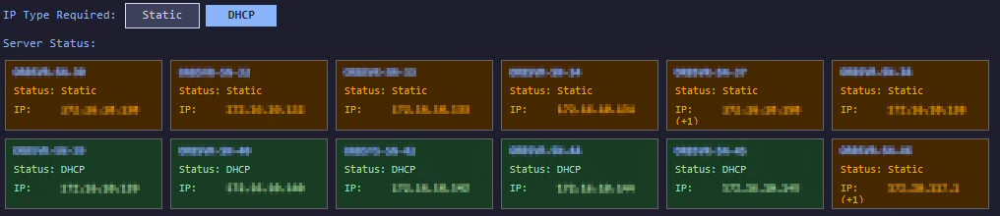
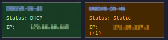
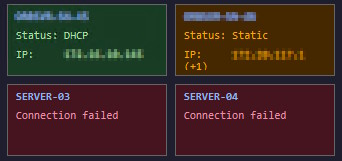
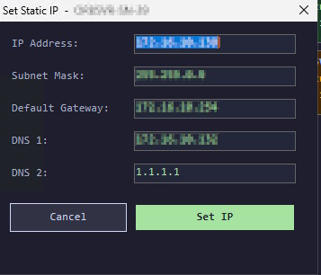

# IP Address Checker — User Guide

> **Script:** `Check-IPConfig_v6.ps1`  
> **Requires:** PowerShell 5.1+, WinRM enabled on target servers, local or domain admin rights.
> Run from domain controller.

---

## Table of Contents

1. [Getting Started](#1-getting-started)
2. [Main Window Overview](#2-main-window-overview)
3. [Entering Servers](#3-entering-servers)
4. [servers.conf — Pre-loading a Server List](#4-serversconf--pre-loading-a-server-list)
5. [IP Type Required Toggle](#5-ip-type-required-toggle)
6. [Running a Scan](#6-running-a-scan)
7. [Server Tiles — Understanding the Colours](#7-server-tiles--understanding-the-colours)
8. [Selecting a Server — IP Detail Panel](#8-selecting-a-server--ip-detail-panel)
9. [Action Buttons](#9-action-buttons)
10. [Setting a Static IP](#10-setting-a-static-ip)
11. [Setting DHCP](#11-setting-dhcp)
12. [Rebooting a Server](#12-rebooting-a-server)
13. [Rescanning a Server](#13-rescanning-a-server)
14. [Status Bar](#14-status-bar)
15. [Error States & Timeouts](#15-error-states--timeouts)
16. [Requirements & Troubleshooting](#16-requirements--troubleshooting)

---

## 1. Getting Started

Save the script to a folder on your machine and run it from PowerShell:

```powershell
& "C:\Tools\Check-IPConfig_v6.ps1"
```

Or right-click the `.ps1` file in Explorer and choose **Run with PowerShell**.

> **Do not paste the script into a PowerShell console.** Variables like `$PSScriptRoot` will be empty and the `servers.conf` auto-load will not work.

If your execution policy blocks the script, run:

```powershell
powershell.exe -ExecutionPolicy Bypass -File "C:\Tools\Check-IPConfig_v6.ps1"
```

---

## 2. Main Window Overview



The window is divided into four horizontal zones:

| Zone | Purpose |
|------|---------|
| **Server Input** | Type or paste server names; `> Run` and `Clear` buttons |
| **IP Type Toggle** | Set whether you expect servers to be Static or DHCP |
| **Server Tiles** | One tile per server showing live status and colour |
| **IP Detail + Actions** | Full adapter breakdown for the selected server, plus action buttons |

---

## 3. Entering Servers

The text box at the top accepts server names or IP addresses in two formats:

**One per line:**
```
SERVER-01
SERVER-02
SERVER-03
```

**Comma-separated on one line (or mixed):**
```
SERVER-01, SERVER-02, SERVER-03
```

Duplicates are automatically removed before the scan starts. The text box holds as many servers as you need — use the scroll bar if the list is long.



---

## 4. servers.conf — Pre-loading a Server List

Place a plain text file named `servers.conf` in the **same folder as the script**. The tool will load it automatically on startup and populate the server input box.

**Format:**

```
# Lines starting with # are comments and are ignored
SERVER-01
SERVER-02
SERVER-03
# Staging
STAGE-01
STAGE-02
```

- Blank lines are ignored
- Comment lines (starting with `#`) are ignored
- Duplicates are removed

If the file is found, the status bar at the bottom will confirm:

```
Loaded 5 server(s) from servers.conf  [C:\Tools\servers.conf]
```

You can still manually add or remove servers from the text box after loading — the file is only read on startup.



---
## 5. IP Type Required Toggle



This toggle tells the tool what IP configuration you **expect** your servers to have. It controls how tiles are coloured:

| Toggle set to | Server is Static | Server is DHCP |
|---------------|-----------------|----------------|
| **Static**    | 🟢 Green (correct) | 🟠 Orange (wrong) |
| **DHCP**      | 🟠 Orange (wrong) | 🟢 Green (correct) |

**Static** is selected by default (shown with a bold blue highlight on the button).

Clicking the toggle instantly recolours all tiles already on screen — you do not need to re-scan. This is useful when auditing an environment where you are switching servers between static and DHCP in batches.





---
## 6. Running a Scan

1. Enter your server names in the input box (or let `servers.conf` fill them in)
2. Click **`> Run`**

Each server is queried as an independent background job — the UI remains fully responsive while scans are in progress. You can click tiles, change the toggle, or interact with results as they come in without waiting for all servers to complete.

The `> Run` button changes to `Running...` and is disabled until all jobs finish or time out.

**Scan behaviour:**
- Each server has a **10 second** connection timeout. If WinRM cannot be reached within that window, the server is marked as failed rather than hanging indefinitely
- If a server connects but the query takes longer than **35 seconds**, the job is killed and the server is marked as timed out
- All other servers continue scanning unaffected

The status bar updates in real time:

```
Querying... 4 server(s) remaining
```

When complete:

```
Done.  Static: 6  DHCP: 3  Error: 2
```

> **Screenshot placeholder:**  
> `[screenshot: scan in progress — some tiles green/orange, some still grey/pending, status bar showing remaining count]`

---

## 7. Server Tiles — Understanding the Colours

Each server gets a tile in the Server Status area. Tiles wrap automatically as more servers are added.

```
┌──────────────────┐
│ SERVER-01        │  ← Server name (blue, always)
│ Status: Static   │  ← IP type detected
│ IP: 10.0.0.6     │  ← Primary IP address
└──────────────────┘
```



**Tile colours:**

| Colour | Meaning |
|--------|---------|
| 🟢 **Dark green** | IP type matches what is required (correct) |
| 🟠 **Dark orange** | IP type does not match what is required (wrong type, not an error) |
| 🔴 **Dark red** | Connection failed, job error, or timed out |
| ⬜ **Grey** | Scan pending or in progress |

**Multiple IP addresses:**

If a server's adapter has more than one IP address bound to it, the tile shows the primary IP with a suffix indicating how many additional IPs exist:

```
IP: 172.16.10.131 (+1)
```

The primary IP shown is the one that shares the same subnet as the default gateway — not simply the first one in the list.

**Clicking a tile** selects it: a 3D border appears around it and the IP Detail panel below updates to show full adapter information for that server.


---
## 8. Selecting a Server — IP Detail Panel

Click any tile to select it. The **IP Detail** panel at the bottom left shows a full breakdown of every network adapter on that server.

**Example output:**

```
== SERVER-01 ==

  Adapter : Ethernet
  Type    : Static
  IP Addr : 172.16.10.132/24
  Subnet  : 255.255.255.0
  Gateway : 172.16.10.254
  DNS 1   : 172.16.10.1
  DNS 2   : 8.8.8.8
  [PRIMARY - DG Subnet Match]

  Adapter : Ethernet 2
  Type    : Static
  IP Addr : 192.168.50.10/24
  Subnet  : 255.255.255.0
  [Additional Adapter]
```

**What each line means:**

| Field | Description |
|-------|-------------|
| `Adapter` | The Windows network adapter name |
| `Type` | `Static` or `DHCP` — shown in green (Static) or blue (DHCP) |
| `IP Addr` | IP address with CIDR prefix length |
| `Subnet` | Subnet mask in dotted decimal |
| `Gateway` | Default gateway (only shown if one is set) |
| `DNS 1 / DNS 2` | DNS server addresses configured on the adapter |
| `[PRIMARY - DG Subnet Match]` | This adapter's IP is in the same subnet as the default gateway — it is treated as the management interface |
| `[Additional Adapter]` | A second or subsequent NIC |
| `[Additional IP - same adapter]` | A second IP bound to the same NIC |

**Output ordering:** The primary adapter (DG subnet match) always appears first. Additional adapters follow in the order returned by the server.

Timestamps are added to the detail log when actions are performed, so you have a running record of what was done and when.

> **Screenshot placeholder:**  
> `[screenshot: IP detail panel showing a server with two adapters, PRIMARY tag visible on first one]`

---

## 9. Action Buttons

Four action buttons appear to the right of the IP Detail panel. They only operate on the **currently selected tile**.

```
[Rescan    ]
[Set Static]
[Set DHCP  ]
[Reboot    ]
```

**Button availability:**

| Button | Enabled when |
|--------|-------------|
| **Rescan** | A tile is selected |
| **Set Static** | Selected server is currently **DHCP** (greyed out if already Static) |
| **Set DHCP** | Selected server is currently **Static** (greyed out if already DHCP) |
| **Reboot** | Selected server was successfully scanned (connection confirmed) |

The **Set Static** and **Set DHCP** buttons are intentionally greyed out when the server already has that configuration — there is nothing to change.

> **Screenshot placeholder:**  
> `[screenshot: action buttons — Set DHCP greyed out because server is already DHCP, Set Static active]`

---

## 10. Setting a Static IP

1. Select a server tile that is currently showing **DHCP**
2. Click **`Set Static`**
3. A dialog appears pre-filled with the server's current IP details:



4. Adjust any values as needed
5. Click **`Set IP`**

The dialog closes immediately and the tool carries out the change **in the background** — you can continue using the application while the change is applied. The tile switches to grey `Setting Static...` to indicate work is in progress.

On success the tile automatically rescans and updates. On failure an error popup describes what went wrong and the buttons are re-enabled.

> **Note:** IP Address and Subnet Mask are required. Gateway and DNS fields can be left blank if not applicable, but this is unusual for a static configuration.

> **Screenshot placeholder:**  
> `[screenshot: Set Static dialog with fields pre-filled from current server data]`

> **Screenshot placeholder:**  
> `[screenshot: tile showing "Setting Static..." grey state while background job runs]`

---

## 11. Setting DHCP

1. Select a server tile that is currently showing **Static**
2. Click **`Set DHCP`**
3. A confirmation dialog appears:

```
Switch SERVER-01 to DHCP?

This will remove the static IP configuration and enable DHCP
on the primary adapter. The server may briefly lose connectivity.

[No]   [Yes]
```

4. Click **`Yes`** to proceed

Like Set Static, the change runs in the background. The tile switches to grey `Setting DHCP...` immediately.

> ⚠️ **Warning:** Switching a server to DHCP removes all static IP, route, and DNS configuration from the primary adapter. If your DHCP server is not available, the server may become temporarily unreachable. Ensure a DHCP lease will be assigned before proceeding.

On success the tile rescans automatically. On failure an error popup is shown.


---

## 12. Rebooting a Server

1. Select a server tile
2. Click **`Reboot`**
3. A confirmation dialog appears:

```
Reboot SERVER-01 now?

This will immediately restart the server.
Auto-rescan will run 30 seconds after the command is sent.

[No]   [Yes]
```

4. Click **`Yes`**

The reboot command is sent immediately. The tile updates to show `Rebooting...` and the status bar begins a 30-second countdown:

```
Auto-rescan SERVER-01 in 29s...
Auto-rescan SERVER-01 in 28s...
...
```

After 30 seconds the tool automatically rescans that server. If the server has not finished booting by then, it will show as a connection error — click **`Rescan`** again once it is online.

> **Screenshot placeholder:**  
> `[screenshot: status bar showing reboot countdown timer]`

---

## 13. Rescanning a Server

Click **`Rescan`** with a tile selected to re-query just that one server without clearing any other results. This is useful when:

- You have just set a static IP or DHCP and want to verify the change
- A server that previously timed out may now be online
- You want to refresh one server's data without re-running the full scan

The rescan uses the same background job and timeout logic as the initial scan.

---

## 14. Status Bar

The status bar at the bottom of the window provides real-time feedback:

| Message | Meaning |
|---------|---------|
| `Ready.` | Application started, no scan run yet |
| `Loaded 5 server(s) from servers.conf [path]` | servers.conf was found and loaded |
| `Querying... 4 server(s) remaining` | Scan in progress |
| `Done.  Static: 6  DHCP: 3  Error: 2` | Scan complete with summary counts |
| `Selected: SERVER-01` | A tile has been clicked |
| `Setting static IP on SERVER-01 (background)...` | Set Static job running |
| `Static IP set on SERVER-01. Rescanning...` | Set Static succeeded |
| `Setting DHCP on SERVER-01 (background)...` | Set DHCP job running |
| `DHCP enabled on SERVER-01. Rescanning...` | Set DHCP succeeded |
| `Rebooting SERVER-01...` | Reboot command sent |
| `Auto-rescan SERVER-01 in 29s...` | Post-reboot countdown |
| `Action failed on SERVER-01` | Set Static or Set DHCP encountered an error |
| `Cleared.` | Clear button was pressed |

---

## 15. Error States & Timeouts

**Connection failed (red tile):**

```
== SERVER-01 ==
  [ERROR] Connecting to remote server SERVER-01 failed...
```

The server could not be reached via WinRM within the 10 second connection timeout. Common causes: server is offline, WinRM not enabled, firewall blocking port 5985, or the hostname does not resolve.

**Timed out (red tile, `Timed out` status):**

```
  [TIMEOUT] No response after 35s
```

The server accepted the WinRM connection but the query did not complete within 35 seconds. This can happen on heavily loaded servers or those with many network adapters. Click **`Rescan`** to try again.

**Action timed out:**

```
  [TIMEOUT] Action timed out after 40s
```

A Set Static or Set DHCP job ran for more than 40 seconds without completing. The change may or may not have been applied — rescan the server to check its current state before trying again.

**No adapters found:**

```
  [INFO] No network adapters with IP configuration found.
```

The server was reachable but returned no configured IPv4 adapters. This is unusual and may indicate the server has only IPv6 configured, or all adapters are disconnected.

---

## 16. Requirements & Troubleshooting

### Requirements

| Requirement | Detail                                                                                             |
| ----------- | -------------------------------------------------------------------------------------------------- |
| PowerShell  | 5.1 or later (built into Windows 10 / Server 2016 and newer)                                       |
| WinRM       | Must be enabled on each target server (`Enable-PSRemoting -Force`)                                 |
| Firewall    | Port **5985** (HTTP) or **5986** (HTTPS) must be open to the target servers                        |
| Permissions | The account running the script must be a local administrator or domain admin on the target servers |

### Enabling WinRM on target servers

Run on each server you want to manage (requires local admin):

```powershell
Enable-PSRemoting -Force
Set-Item WSMan:\localhost\Client\TrustedHosts -Value "*" -Force
```

> For domain environments, WinRM is often already enabled via Group Policy. Check with your AD team before enabling it manually.

### Common errors

**"Access is denied"**  
The account running the script does not have admin rights on the target server.

**"The WinRM client cannot complete the operation within the time specified"**  
WinRM is enabled but responding slowly. The 10s connection timeout may need increasing — edit `$sessionOpt` in the script and raise `OpenTimeout`.

**"No connection could be made because the target machine actively refused it"**  
WinRM is not listening. Run `Enable-PSRemoting` on the target server or check that the Windows Remote Management service is running.

**servers.conf not loading**  
Ensure the file is named exactly `servers.conf` (no `.txt` extension) and is in the **same folder** as the `.ps1` script. The status bar will show the full path it found the file at — check that matches where you saved it.

**Set Static fails with "The term 'New-NetIPAddress' is not recognised"**  
The target server is running Windows Server 2008 R2 or earlier, which uses `netsh` rather than the `NetTCPIP` module. The script requires Server 2012 or later on the target.

---

*Generated for Check-IPConfig_v6.ps1*
